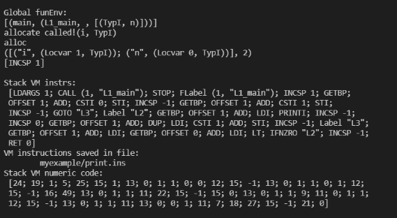
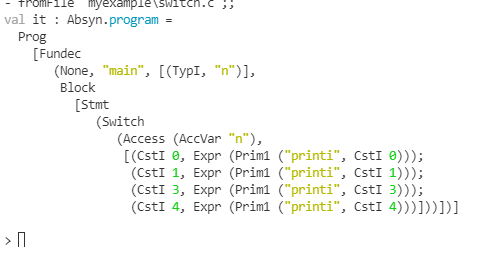
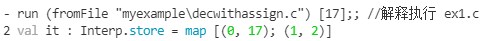
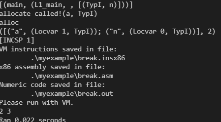
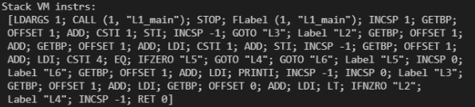

# [**实 验 报 告**](http://sigcc.gitee.io/plc2021/#/./lab/proj.final?id=实-验-报-告)


- 课程名称:编程语言原理与编译
- 实验项目:期末大作业
- 专业班级：计算机2001
- 学生学号：32001151 32001130
- 学生姓名：司德昊 张文杰
- 实验指导教师:郭鸣

# 运行脚本

```F#
#r "nuget: fslexyacc"

#load "Absyn.fs";;
#load "Debug.fs";;
#load "CPar.fs";;
#load "CLex.fs";;


open FSharp.Text.Lexing

let show e = 
  printfn "%A" e

let test s =
    let lexbuf = LexBuffer<char>.FromString (s+"\n") in
    CPar.Main CLex.Token lexbuf;

```

```F#
dotnet build ./interpc.fsproj
dotnet fsi

#r "nuget: FsLexYacc";;  //添加包引用
#load "Absyn.fs" "Debug.fs" "CPar.fs" "CLex.fs" "Parse.fs" "Interp.fs" "ParseAndRun.fs" ;; 

open ParseAndRun;;    //导入模块 ParseAndRun
fromFile "myexample\unary.c";;    //显示 ex1.c的语法树
run (fromFile "example\ex1.c") [17];; //解释执行 ex1.c
run (fromFile "myexample\unary.c") [8];; //解释执行 ex11.c

Debug.debug <-  true  //打开调试
```

# 实现的功能点

- （**）注释
- 前缀自增自减
- For循环
- switch语法
- break

## （**）注释

### 测试代码

```c
//test1 (* *)注释测试

void main(int n){
    //annotation 1
    /*annotation 2*/
}
 (* here is annotation 0*)
   
void main(int n){
    //annotation 1
    /*annotation 2*/
   (* here is annotation 0*)
   
}

void main(int n){
    //annotation 1
    /*annotation 2*/
   (* here (*is annot*)ation 0*)
   
}
```

### 解释执行

.png)

## 自增自减

### 测试代码

```c
// 测试自增自减
void main (int n){
    int i;
    i=5;
    print i;
    print ++i;
    print i;
    print --i;
    print i;
}

/*
void main (int n){
    int i;
    //i++;

}
*/
/*
void main (int n){
    int i;
    i++;
    i--;
}
*/

```

### 语法树

.png)

### 解释运行

.png)

## FOR循环实现

### 测试代码

```c
/*
void main(int n){
    print n;
}
*/
void main(int n){
    int i;
    i=0;
    for(i=1;i<n;i++){
        print i;
    }
}
```



### 语法树

.png)

### 解释执行

)

## switch

## 测试代码

```
void main(int n){

    switch(n){
        case 0:print 0;
        case 1:print 1;
        case 3:print 3;
        case 4:print 4;

    }

}
```

### 语法树



### 解释执行



## **break**

### 测试代码

```
void main (int n){
/*
    if( n > 0)
        print n;

  */  
  
    int a ;
    a = 1;
    while(a  < n){
        a = a+1;
        if(a==4) break;
        print a;
    }
 
}
# 执行命令
# .\bin\Debug\net5.0\microc.exe -g .\myexample\break.c 5;
# .\bin\Debug\net5.0\machine.exe  .\break.out 7
```

### 编译执行




### 指令



# 总结

## 绩效评价

| 姓名   | 学号     | 班级       | 任务       | 权重   |
| ------ | -------- | ---------- | ---------- | ------ |
| Name   | No.      | Class      | Task       | Factor |
| 司德昊 | 32001151 | 计算机2001 | 设计、编码 | 1.0    |
| 张文杰 | 32001130 | 计算机2001 | 报告，测试 | 0.9    |

## 成员代码提交日志

## 完成情况

| 实现         | 完成评价 | 备注 |
| ------------ | -------- | ---- |
| （**）注释   | ⭐⭐⭐   |      |
| 前缀自增自减 | ⭐       |      |
| For循环      | ⭐       |      |

## 个人经验教训总结
